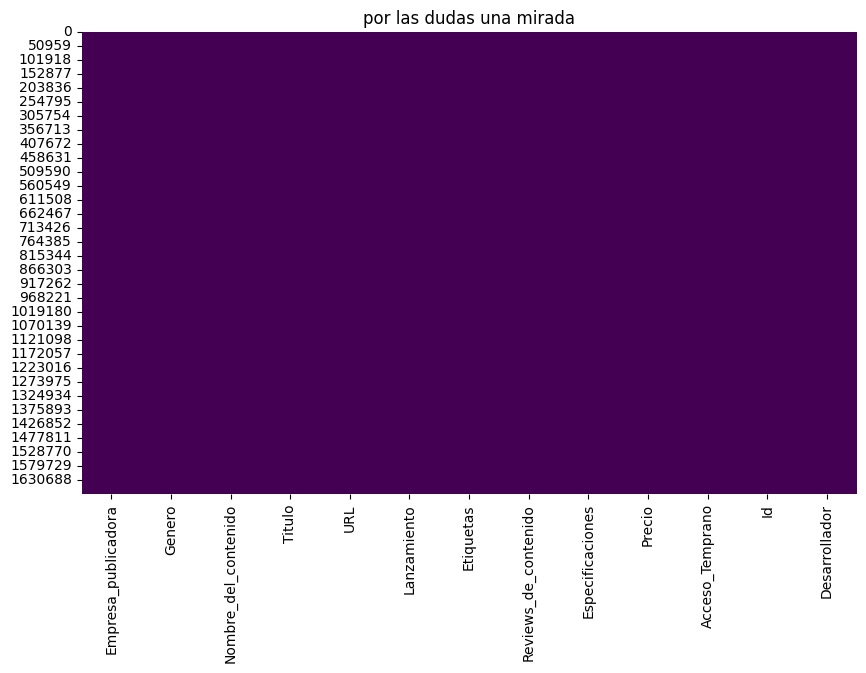
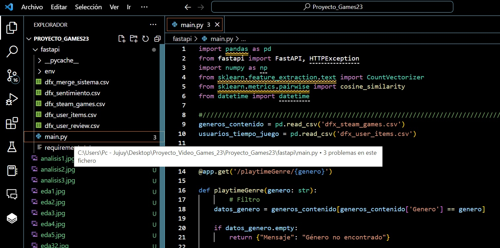
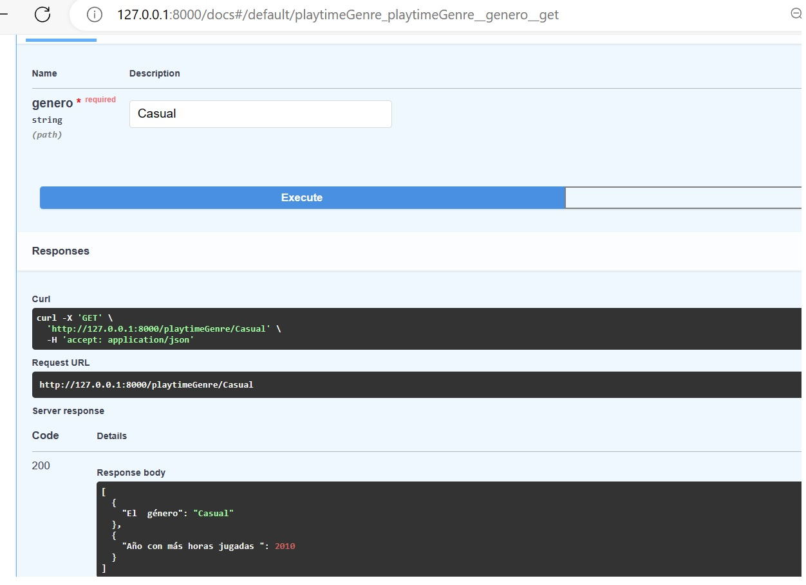

<h1 align='center'>
 <b>PROYECTO INDIVIDUAL Nº1 - Antonio Claudio Ortiz</b>
</h1>
 
# <h1 align="center">**`Machine Learning Operatios(MLops)`**</h1>

## **Empecemos a platear la solucion con los archivos fuentes proporcionados:**

**1- steam_games.json.gz**

**2- user_reviews.json.gz**

**3- users_items.json.gz**

### En primera instancia el proyecto se realizo en :

## DESCRIPCION DEL JUPYTER

Como se observa en la imagen la primera parte del proyecto corresponde a la transformacion de los datos, la limpieza de los correspondientes DataFrames creados como almacenamientos auxiliares para manipular y derivar en un archivo.csv asi de esa forma utilizarlos en otra fase del trabajo.
-----------------------------------------------------------------------------------------------------------

### Comenzamos analizando Steam_Games por medio de un grafico

 
 ### Con un gran porcentaje de elementos nulos

 **Se le aplica la linea de codigo:**

                                    df_gral.dropna(inplace=True)

**Dando como resultado la limpieza del DataFrame df_gral**

### ademas

1- Se Desanida las columnas con multiples valores como por ejemplo la Columna Genero

2- Se Renombra las columnas 

3- Se consulta periodicamente el estos del Dataframe por medio df_gral.info()

4- Se verifica por medio de grafico la existencia de elementos nulos 

## Una vez realizado las correspondientes limpiezas al Dataframe, se lo almacena en un CSV y se toma una muestra

                df_gral= df_gral[0:20000]
                df_gral.to_csv("/content/drive/MyDrive/Proyect_games/dfx_steam_games.csv", index=True)

### Continuamos con Users_Reviews

#### Despues de su lectura y almacenamiento al dataframe df se observa que al desanidar la columna reviews surgen elementos nulos: 

 ### Como la columna 0 no es representativa se decide borrarla
                    df = df.drop(columns = [0])

### Despues de las verificaciones de rutina se deriva al CSV

                df.to_csv("/content/drive/MyDrive/Proyect_games/dfx_user_review.csv", index=True)

### Con respecto a users_items
### Lo llamativo de este archivo, es que al desanidar la columna items, crecio exponencialmente los datos:
### de 88 mil registros a 5 millones 

### Para realizar las funciones futuras se tomaran muestras y se las almacenara en un CSV: 

                    df2= df2[0:10000]

                    df2.to_csv("/content/drive/MyDrive/Proyect_games/dfx_user_items.csv", index=True)

## Analisis de Sentimientos

La Consigna:

En el dataset user_reviews se incluyen reseñas de juegos hechos por distintos usuarios. Debes crear la columna 'sentiment_analysis' aplicando análisis de sentimiento con NLP con la siguiente escala: debe tomar el valor '0' si es malo, '1' si es neutral y '2' si es positivo. Esta nueva columna debe reemplazar la de user_reviews.review para facilitar el trabajo de los modelos de machine learning y el análisis de datos. De no ser posible este análisis por estar ausente la reseña escrita, debe tomar el valor de 1.

**Analsis de Sentimiento** tomada del siguiente articulo, https://neuraldojo.org/proyectos/analisis-de-sentimiento/guia-basica-de-analisis-de-sentimiento-en-python/

**Paso 1: Leer el dataframe** Dataframe df que esta relacionada con user_reviews

**Paso 2: Análisis de Datos**

Columna a analizar

        posted

        recommend

        review

**Ahora crearemos la nube de palabras “wordclouds” más utilizadas en las reseñas empleando la librería “NLTK” y la librería “wordcloud”.**

**Paso 3: Clasificando los tweets**

        df['Sentimiento'] = df['Recomendacion'].apply(lambda Recomendacion: 2 if Recomendacion else 0)

despues de un proceso de limpieza obtenemos

Ademas hay que unificcar Dataframe
        
        merge_sentimiento= pd.merge(df_gral,df, on = "Item_id")

### Para realizar las funciones futuras se tomaran muestras y se las almacenara en un CSV:

        merge_sentimiento = merge_sentimiento[0:5000]
        merge_sentimiento.to_csv("/content/drive/MyDrive/Proyect_games/dfx_sentimiento.csv", index=True)

## Ahora comenzamos con la Fase del EDA(Analisis Exploratorio de Datos)

# **EDA - Analisis Exploratorio de Datos- Steam Games**
**[Verifacion de elementos Nulos en steam_games.json.gz](https://)**

**Exploración de Variables Categoricas de Steam games**

# **EDA - Analisis Exploratorio de Datos- User Review**
**[Verifacion de elementos Nulos en user_items.json.gz](https://)**

**Analisis de Variables**

# **EDA- Analisis Exploratorio de Datos - Users_Items**

**Analisis de variable numerica y categorica**

        len(df2['items_cantidad'].unique())
        df2['items_cantidad'].unique().tolist()
        value_counts = df2["item_nombre"].value_counts()

## Desarrollo API: Propones disponibilizar los datos de la empresa usando el framework FastAPI. Las consultas que propones son las siguientes:

### La misma se desarrollo en el entorno de desarrollo Visual Code

Vamos a probar la primera funcion  aplicacion 
        
        def PlayTimeGenre( genero : str ): Debe devolver año con mas horas jugadas para dicho género

Datos de prueba

Action

Indie

Casual

### Ahora 
        def UserForGenre( genero : str ): Debe devolver el usuario que acumula más horas jugadas para el género dado y una lista de la acumulación de horas jugadas por año.

Datos de Prueba

Strategy

Free to Play

+Sports

### continuamos con la tercera funcion

        def UsersRecommend( año : int ): Devuelve el top 3 de juegos MÁS recomendados por usuarios para el año dado. (reviews.recommend = True y comentarios positivos/neutrales)

Datos de Prueba

1998

2006

2010

### continuamos con la cuarta funcion

def UsersNotRecommend( año : int ): Devuelve el top 3 de juegos MENOS recomendados por usuarios para el año dado. (reviews.recommend = False y comentarios negativos)

Datos de Prueba

1998

2006

2010

### La quinta funcion 

        def sentiment_analysis( año : int ): Según el año de lanzamiento, se devuelve una lista con la cantidad de registros de reseñas de usuarios que se encuentren categorizados con un análisis de sentimiento.

Datos de Prueba

2009

2007

2004

## Vamos a subir nuestras funciones a Render

### Nota: por cuestion de version gratuita de render y sus politicas de Administracion de recursos

### vamos a subir en dos partes el trabajo.

 ### Las funciones expuestas anteriomente estan en el siguiente enlace:

 https://apis-games23.onrender.com/docs#/

 ### Y la funcion de Recomendaciones 

 https://sistema-de-recomendacion-h1ms.onrender.com/docs#/

 ### Modelo de aprendizaje automático

        def recomendacion_juego( id de producto ): Ingresando el id de producto, deberíamos recibir una lista con 5 juegos recomendados similares al ingresado.

Datos de prueba

22380

67000

80300

18040

6120

### Enlace de Github

https://github.com/claudiogit2019/Proyecto_Games23.git

https://github.com/claudiogit2019/Proyecto_Games23_SRecomendacion.git

### Enlace de Google Colab

https://colab.research.google.com/drive/1GB3aKhteC0aSt5PubYf9vTOJnf9N6SIs?usp=sharing

